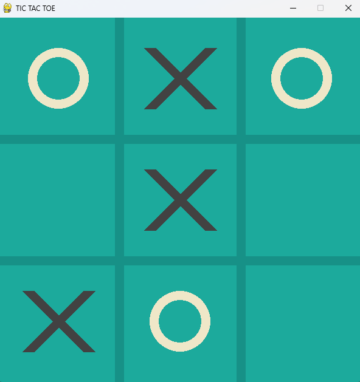
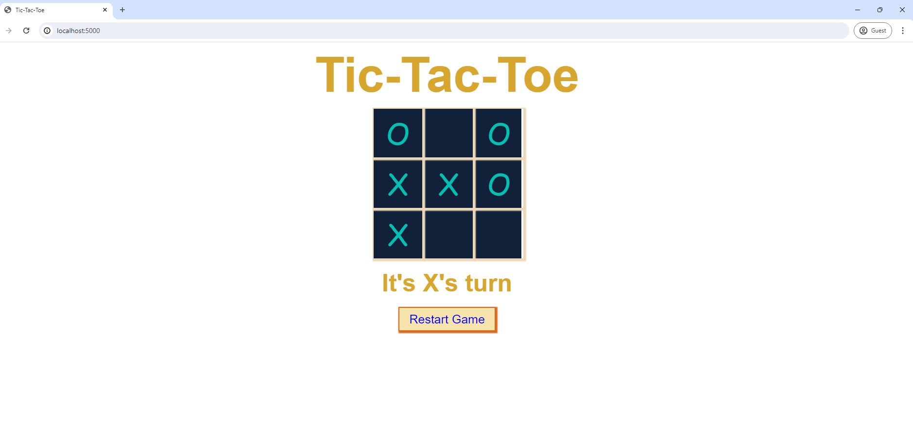

# Tic Tac Toe


## Installation

We need to Download a number of libraries and also create an environment before running the site.

Step 1: Create the Folder and clone the project, now Change directory into FOLDER_NAME

```
$ git clone https://github.com/phongnd2802/tic-tac-toe-web-app .
```

Step 2: Create an environment

```
$ python -m venv venv
$ venv\Scripts\activate
```

Step 3: Install the requirements for the project using the command...

```
$ pip install -r requerements.txt
```

## Demo

* Window App UI

```
$ python window_app.py
```


* Web UI

```
$ python app.py
```

Access https://localhost:5000 in browser




